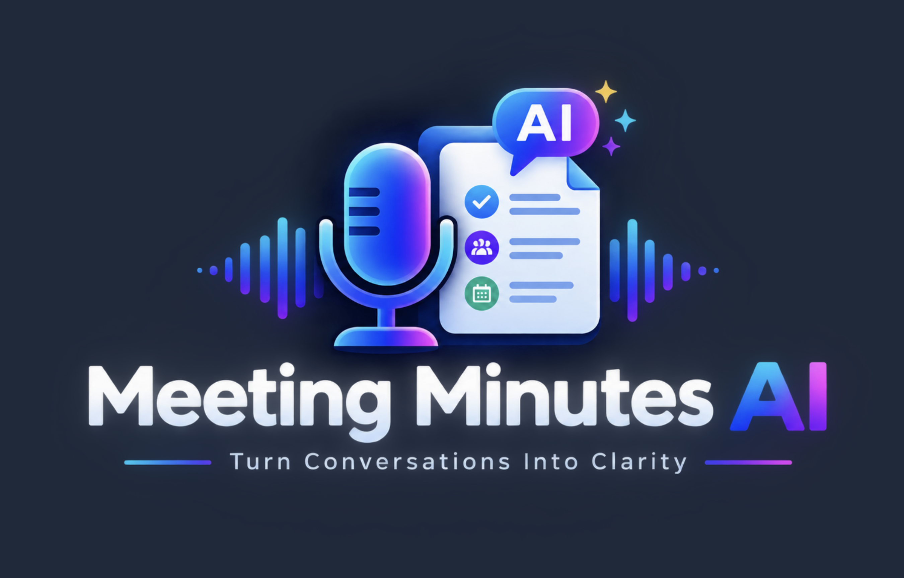
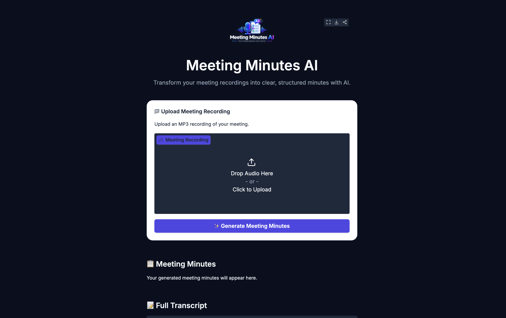
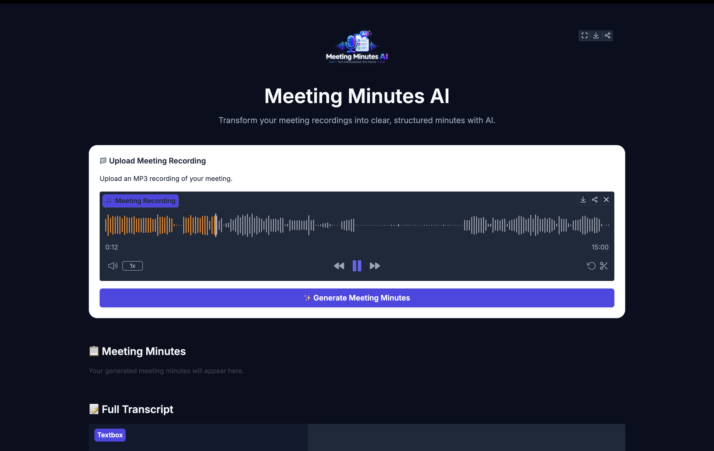
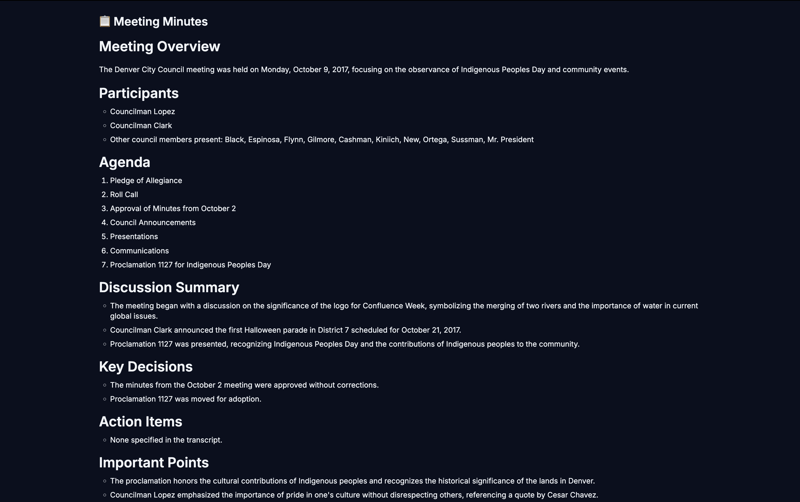
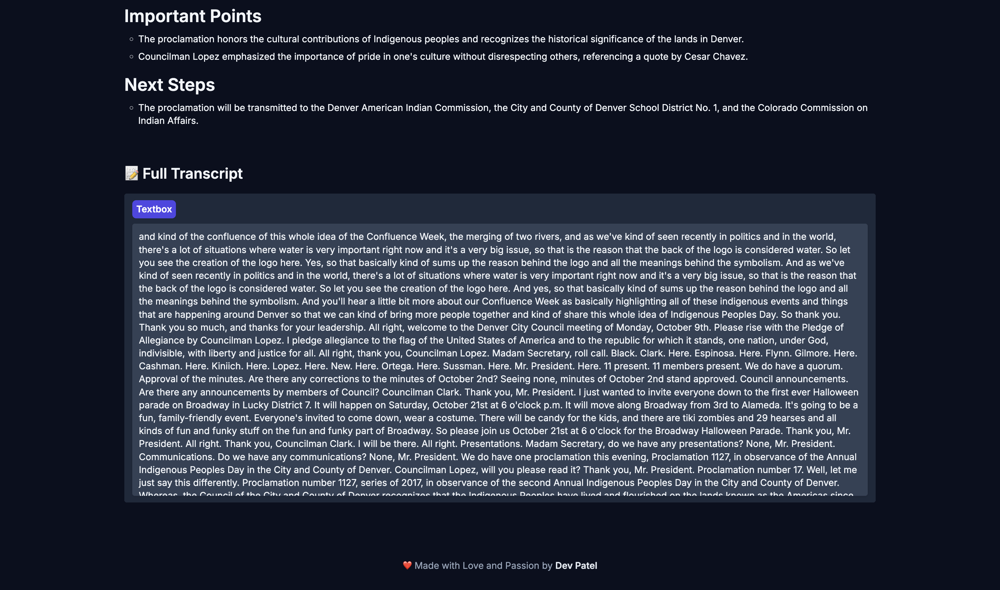

# 🎙️ Meeting Minutes AI

An AI-powered application that converts meeting recordings into clear, structured, and professional meeting minutes.

Upload an MP3 meeting recording and the application automatically generates a full transcript and structured meeting minutes.

## ✨ Features

- 🎙️ MP3 meeting recording upload
- 📝 Automatic audio transcription
- 🤖 AI-powered meeting analysis
- 📋 Structured meeting minutes
- 🎯 Key decisions
- ✅ Action items
- 📌 Important points
- 🚀 Next steps
- 🎨 Clean Gradio interface
- 🖼️ Custom application branding
- 💻 Local development support

---

## 🧠 Workflow

```text
🎙️ MP3 Recording
       ↓
OpenAI gpt-4o-mini-transcribe
       ↓
📝 Full Transcript
       ↓
OpenAI GPT-4o-mini
       ↓
📋 Meeting Minutes
```

The application uses a two-stage AI pipeline.

### 1. Audio → Transcript

The uploaded MP3 recording is processed using OpenAI's transcription model.

```text
MP3 Recording
      ↓
OpenAI gpt-4o-mini-transcribe
      ↓
Full Transcript
```

### 2. Transcript → Meeting Minutes

The generated transcript is analyzed using GPT-4o-mini to create structured meeting minutes.

```text
Full Transcript
      ↓
OpenAI GPT-4o-mini
      ↓
Meeting Minutes
```

---

# 🖥️ Screenshots

## Application Interface



## Meeting Recording Upload



## Audio Transcription



## Generated Meeting Minutes



## Full Transcript



---

# 🛠️ Tech Stack

| Technology | Purpose |
|---|---|
| Python | Application development |
| Gradio | User interface |
| OpenAI API | AI processing |
| gpt-4o-mini-transcribe | Audio transcription |
| GPT-4o-mini | Meeting analysis |
| python-dotenv | Environment variables |

---

# 🦙 Llama & Hugging Face Exploration

During development, an alternative GPU-based architecture was also explored using:

- Meta Llama 3.1 8B Instruct
- Hugging Face Transformers
- Hugging Face Hub
- BitsAndBytes
- 4-bit quantization
- PyTorch
- GPU inference
- Hugging Face ZeroGPU

The explored architecture was:

```text
🎙️ MP3 Recording
        ↓
OpenAI Transcription
        ↓
📝 Transcript
        ↓
Llama 3.1 8B Instruct
        ↓
BitsAndBytes 4-bit
        ↓
GPU Inference
        ↓
📋 Meeting Minutes
```

Llama 3.1 8B is a considerably larger model and practical inference requires suitable GPU resources.

BitsAndBytes 4-bit quantization can reduce memory usage, making GPU inference more practical.

For the current local version of this project, OpenAI is used for meeting analysis so the complete application can run locally without requiring a dedicated GPU.

---

# 💻 Local Setup

## 1. Clone the repository

```bash
git clone <YOUR_GITHUB_REPOSITORY_URL>
cd meeting-minutes-ai
```

## 2. Create a virtual environment

Python 3.11 is recommended.

```bash
python3.11 -m venv .venv
```

## 3. Activate the virtual environment

### macOS / Linux

```bash
source .venv/bin/activate
```

### Windows

```bash
.venv\Scripts\activate
```

## 4. Install dependencies

```bash
pip install -r requirements.txt
```

## 5. Configure OpenAI API Key

Create a `.env` file in the project root:

```env
OPENAI_API_KEY=your_openai_api_key
```

Never commit the `.env` file to GitHub.

## 6. Run the application

```bash
python app.py
```

The Gradio application will start locally.

---

# 🔐 Security

The project uses environment variables for API keys.

The `.env` file should be included in `.gitignore`:

```gitignore
.venv/
.env
__pycache__/
*.pyc
.DS_Store
```

API keys should never be hardcoded into the source code or committed to GitHub.

---

# 📁 Project Structure

```text
meeting-minutes-ai/
│
├── assets/
│   └── logo.png
│
├── screenshots/
│   ├── ss1.png
│   ├── ss2.png
│   ├── ss3.png
│   ├── ss4.png
│   └── ss5.png
│
├── src/
│   ├── __init__.py
│   ├── config.py
│   ├── meeting_analyzer.py
│   ├── prompts.py
│   ├── transcription.py
│   └── utils.py
│
├── ui/
│   ├── __init__.py
│   ├── styles.py
│   └── theme.py
│
├── app.py
├── requirements.txt
├── README.md
├── LICENSE
└── .gitignore
```

---

# 🎯 Project Goal

Meeting Minutes AI is designed to reduce the manual effort required to convert long meeting recordings into useful documentation.

### Traditional Process

```text
Listen to Recording
        ↓
Take Notes
        ↓
Review Recording
        ↓
Write Meeting Minutes
        ↓
Identify Action Items
```

### With Meeting Minutes AI

```text
Upload MP3
     ↓
AI Transcription
     ↓
AI Analysis
     ↓
Meeting Minutes
```

---

# 🚀 Future Improvements

- 👥 Speaker identification
- 📄 PDF export
- 📝 DOCX export
- 📧 Email-ready summaries
- 💾 Meeting history
- 🔍 Search across meetings
- 🌐 Multi-language support
- 📅 Automatic meeting metadata extraction

---

# 📜 License

This project is licensed under the MIT License.

See the [LICENSE](./LICENSE) file for details.

---

# 👨‍💻 Author

## Dev Patel

Made with ❤️ and passion.

> **Turn Conversations Into Clarity.**